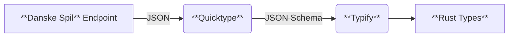

# henze-ds
Application for retrieving Henze-compliant betting odds from Danske Spil

## Approach

### Generating Rust Types for the Danske Spil API

To define types for the Danske Spil API in Rust, a sequence of tools is used to semi-automate the process of generating type-safe Rust structures from the JSON responses returned by the Danske Spil API. Parsing the API responses to Rust types rather than manipulating the JSON directly makes for more readable and maintainable code. The JSON returned by the Danske Spil API is converted to a JSON Schema using [Quicktype](https://quicktype.io/), and this schema is in turn input to [Typify](https://github.com/oxidecomputer/typify) to generate corresponding [Rust types](./henze-ds/src/ds_client/schema.rs).