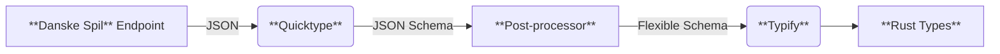

# henze-ds
Application for retrieving Henze-compliant betting odds from Danske Spil

## Approach

### Generating Rust Types


```mermaid
flowchart LR
    A[**Danske Spil** Endpoint] --> |JSON|B(**Quicktype**)
    B -->|JSON Schema| C[**Post-processor**]
    C -->|Flexible Schema| D(**Typify**)
    D --> E[**Rust Types**]
```

Rust types are defined for the JSON objects fetched via the Danske Spil API in a semi-automatic manner. Parsing the API responses to Rust types rather than manipulating the JSON directly makes for more readable and maintainable code. The JSON returned by the Danske Spil API is converted to a JSON Schema using [Quicktype](https://quicktype.io/), then made flexible by a post-processing script, and finally input to [Typify](https://github.com/oxidecomputer/typify) to generate corresponding [Rust types](./henze-ds/src/ds_client/schema.rs).

#### Making the Schema Flexible

Quicktype generates strict schemas with `additionalProperties: false` and fixed enum variants. This causes deserialization to fail when the API returns unexpected fields or new enum values. The [schema-flex](./schema-flex) tool addresses this by:

1. **Removing `additionalProperties: false`** - Unknown fields are silently ignored instead of causing errors
2. **Converting string enums to plain strings** - Unknown enum values are accepted as strings instead of causing deserialization errors

#### Regenerating Types

```bash
# 1. Fetch fresh JSON from the API and generate schema
quicktype https://content.sb.danskespil.dk/... -l schema -o henze-ds/src/ds_client/schema.json

# 2. Make the schema flexible
cargo run -p schema-flex -- henze-ds/src/ds_client/schema.json

# 3. Rebuild to regenerate Rust types via Typify
cargo build
```